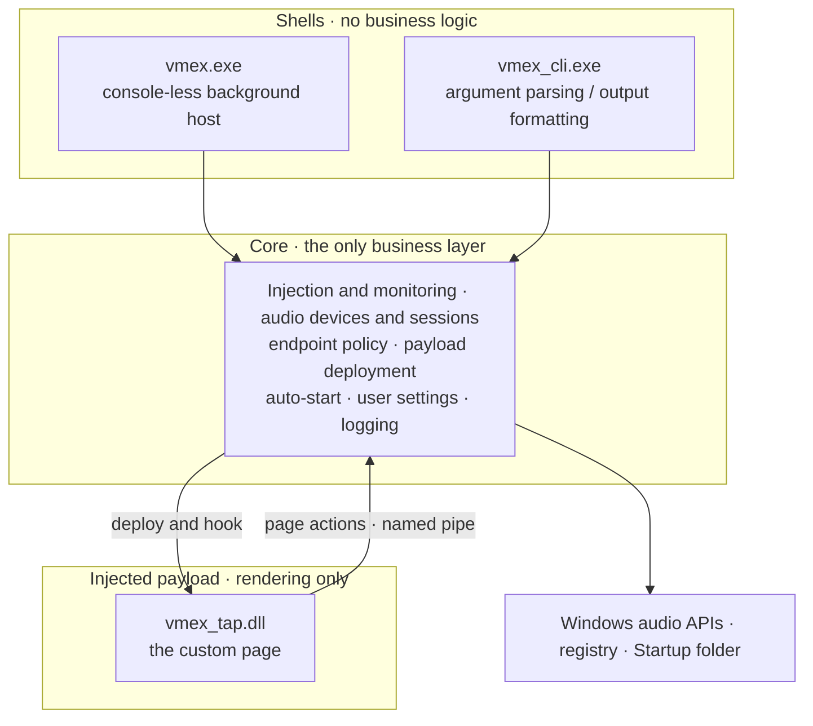

<!--
 readme编写规范：
  1. 所有readme都需要保留本说明且不可做任何翻译修改。主readme(中文版)是本说明的唯一源头(Source of Truth)，禁止将非中文版本中被修改的说明同步回主readme。非中文版的此说明需始终保持与主readme单向同步更新。
  2. 非中文版本的readme必须保留主readme(中文版)的所有视觉元素、HTML 标签、图标路径和排版格式，非中文版本的readme是中文版的完整对应精准同步翻译版，翻译不可笼统，不可修改原意，不可增减内容。
  3. 针对目标语言环境进行功能描述的本土化。
  4. 非中文版本的readme需要合理修改指向资源的路径，确保资源能够正确显示。
  5. 非中文版本的readme都需要保留并置顶本说明
  6. 非中文版本的readme都需要置顶以下元素，可以替换为相应的翻译版本但必须保留原意：
	    <div align="right">
	    <a href="../readme.md">For the latest updates, please refer to the Chinese README.</a>
	    </div>
  7. 任何关于项目内容的更新，必须首先在主readme(中文版)中完成。在主版确认无误后，再根据本规范同步至其他语言版本。
  8. 非中文版本的readme顶部的语言切换器仅保留指向主readme(中文版)的链接，不互相跳转。非中文版本的入口仅在主readme中统一显示。
-->
<div align="right">
  <a href="../../README.md">For the latest updates, please refer to the Chinese README.</a>
</div>
<div align="center">

# VolumeMixerExtender

**Turning the volume panel in Quick Settings into a complete mixer**

  <a href="https://github.com/EricZhang233/VolumeMixerExtender/releases/latest"></a>
  <a href="https://github.com/EricZhang233/VolumeMixerExtender/releases/latest"></a>
  <a href="https://github.com/EricZhang233/VolumeMixerExtender/stargazers"></a>

  [](https://isocpp.org/)
  [](https://cmake.org/)
  [](https://www.microsoft.com/windows)
  [](https://www.gnu.org/licenses/gpl-3.0.html)

<a href="#highlights">Highlights</a> • <a href="#quickstart">Quick Start</a> • <a href="#features">Features</a> • <a href="#cli">CLI</a> • <a href="#architecture">Architecture</a> • <a href="#faq">FAQ</a>

</div>

---

<a name="highlights"></a>

## Highlights

*   🎛️ **The entry is the page**: picking the audio output entry in Quick Settings no longer lands on the system's native sound page, but goes straight to the custom page; opening the sound page with `Win+Ctrl+V` behaves the same way.
*   🔊 **Default devices in one click**: output and input devices each get their own list — click a device row to make it the system default, with the current default highlighted in the accent colour.
*   🎚️ **Endpoint and per-app volume**: device master volume, per-app volume and mute, and live level meters all live on one page, so there is no more digging through system settings.
*   🔀 **Per-app output redirection**: send a single app to a specific output device — "game to the headset, player to the speakers"; a redirected app always shows where its audio goes.
*   🧹 **Clear every redirection at once**: the left footer slot returns all apps to the default device, with the result visible immediately.
*   🪟 **Three pages, one footer**: the custom page, the settings page and the system page share the same footer row and can be switched at any time, leaving the native page intact.
*   💻 **Command-line management**: `vmex_cli.exe` covers injection, status, endpoints, default devices, redirection and auto-start, with full documentation built into `-help` and `skill`.
*   🚀 **Extract and run**: `vmex.exe` stays resident without a console, hooks in automatically and runs as a single instance — no window and no tray icon.

---

<a name="quickstart"></a>

## Quick Start

### Requirements

| Item | Requirement |
| :--- | :--- |
| Operating system | Windows 11 26H2 (Build 26300) or later, x64 |
| Runtime dependencies | None. Fully native, with no .NET or third-party runtime to install |
| Administrator rights | Not required — everything runs per-user (only `HKCU` and your user folders are written) |
| Installation | Not required — extract the archive and run |

### Three steps

1. **Download**: grab the latest archive from [Releases](https://github.com/EricZhang233/VolumeMixerExtender/releases) and extract it anywhere (paths with spaces or non-ASCII characters are fine).
2. **Run**: double-click `vmex.exe`. It has no console window; it stays resident in the background and hooks into the system shell automatically, showing one notification on startup and another once the hook is complete. To have it ready right after sign-in, turn on **Settings → Start with Windows** on the custom page.
3. **Use it**: press `Win+A` to open Quick Settings and pick the audio output entry — what you see is the custom page.

> 💡 Prefer the command line? `vmex_cli.exe -help` lists every command, and `vmex_cli.exe skill` prints the integration document for scripts and AI agents.

---

<a name="features"></a>

## Features

### Taking over the audio output entry

*   **Content swapped, navigation untouched**: once the sound page appears its content area is replaced, the original content is kept intact and handed back as-is when you switch to the system page.
*   **All four paths are covered**: the entry button and `Win+Ctrl+V` both land on the custom page; Accessibility, Cast and other pages stay untouched, so nothing is taken over by mistake.
*   **Re-evaluated on every open**: the panel is rebuilt each time it opens and the page is applied again — no restart needed and no "works only once" behaviour.

### Default devices and endpoint volume

*   **The "Volume" layer is the default-device switch**: every output device is listed; select a device row to make it the system default, with the current default highlighted in the accent colour.
*   **One row per device**: name, mute button, volume slider and live level meter sit side by side, and dragging takes effect immediately.
*   **Capture devices are collapsed**: capture devices fold into a single "Input devices (N)" row that expands on click, so they never crowd out the output list.
*   **The "Show driver name" switch**: device rows, the redirect drop-down and the "→ endpoint" line all decide together whether names carry the driver suffix. On by default, remembered as soon as you change it.

### Volume mixer

*   **Per-app control**: app icon, name, volume slider and mute button share one row, so adjusting a single app no longer means digging through system settings.
*   **Icons come from the program itself**: when no icon can be extracted the row falls back to an initial-letter tile instead of a blank.
*   **Sessions heal themselves**: sessions are re-enumerated every time the panel opens, so after an audio-service restart or a user switch the list is rebuilt automatically instead of staying blank forever.
*   **Empty lists say so**: when nothing is playing you see "(No apps are currently playing sound)".

### Per-app output redirection

*   **Click the redirection bottom to expand**: choose a target output device from the drop-down; the first entry, "Default device", clears the redirect and follows the system default again.
*   **The destination is always visible**: a redirected app shows a "→ endpoint" line under its name, so you can see at a glance which device it is currently using.
*   **System sounds stay out**: the `System sounds` row offers no redirection.
*   **One-click clear**: the left footer slot, "Clear redirection", returns every app to the default device and refreshes the page immediately.

### Settings page

| Item | Description |
| :--- | :--- |
| **Start with Windows** | Registers or removes the sign-in auto-start. The switch reads the auto-start entry itself, so it also honestly shows "off" when Windows has disabled it under Task Manager → Startup |
| **Show driver name** | Whether device names carry the driver suffix; on by default |
| **Exit** | Ends the hook and quits the background host; the system shell restarts and the volume panel returns to its native state |
| **Uninstall from system** | After five consecutive clicks (no more than 0.5 s apart) it deletes the auto-start entry and ends the shell process; it only falls back to native system behaviour and never deletes program files |

### Background host and notifications

*   Double-clicking `vmex.exe` is all it takes: no console window, no tray icon, no main window.
*   One system notification on startup and another once the hook is complete; it stays quiet when it was started by the sign-in auto-start.
*   Single instance: when it is already running, a second launch is refused instead of starting another copy.

---

<a name="cli"></a>

## CLI: the desktop and the terminal share one core

`vmex_cli.exe` and `vmex.exe` link against the same Core (`vmex_core.dll`) and read and write the same state — change something from the command line and the panel shows the new value the next time it opens.

Two documents ship inside the program, so there is nothing else to look up:

```powershell
vmex_cli.exe -help     # every command and argument
vmex_cli.exe skill     # the integration document for scripts and AI agents
```

This version can do the following from the command line: payload extraction, injection and status queries, the background host, endpoint enumeration (`devices`), default-device switching (`default`), per-app redirection and clearing it (`redirect` / `clear-redirect`) and sign-in auto-start (`autostart`). The full list and its arguments live in `-help`, which is updated together with the program.

---

<a name="architecture"></a>

## Architecture

Every line of business logic in **VolumeMixerExtender** exists exactly once: both shells (the background host and the console) share a single Core, with no parallel implementations.



*   **Fully native**: C++20 + CMake with zero third-party libraries; the archive contains just `vmex.exe`, `vmex_cli.exe` and `vmex_core.dll`, while the injected payloads are embedded in the program and extracted on demand.
*   **One Core**: the background host and the command line share the business layer, so features stay aligned and logging is unified.
*   **The page is the payload**: the interface is rendered by a module injected into the system shell, following the system light/dark theme and accent colour — no extra window and no tray presence.
*   **Actions go through a local pipe**: write operations from the page are handed to the host over a named pipe, so the page itself never holds system handles for long.
*   **Facts, not mirrors**: default devices and redirections are read straight from the current system state, with no local copy that could drift out of sync.
*   **Security boundary**: it runs at the same integrity level as the system shell, requests no administrator rights and modifies no system files.

---

<a name="faq"></a>

## FAQ

<details>
<summary><b>Why is there a vmex.exe in Task Manager?</b></summary>

It is the background host: it hooks into the system shell and makes the actions you take on the page actually happen. It has no window and no tray icon, and it uploads nothing. When you no longer need it, end it with **Settings → Exit** on the custom page.
</details>

<details>
<summary><b>How do I exit completely instead of staying in the background?</b></summary>

Open **Settings** from the middle slot of the custom page footer and click "Exit": the hook is ended, the background host quits, the system shell restarts and the volume panel returns to its native state. The "Start with Windows" switch is unaffected — turn it off on the same page if you want it gone.
</details>

<details>
<summary><b>Does it need installing, and does it write to the registry?</b></summary>

No installation is required — extract and run. The only places it does write are: creating a shortcut in the Startup folder when "Start with Windows" is enabled; storing user settings (for example "Show driver name") under `HKCU\Software\EricSoft\VolumeMixerExtender`; and extracting its own payloads to a temporary folder and hooking into the system shell. It modifies no system files and needs no administrator rights.
</details>

<details>
<summary><b>Where is my data stored?</b></summary>

| Content | Location |
| :--- | :--- |
| User settings | `HKCU\Software\EricSoft\VolumeMixerExtender` |
| Program configuration | `%LOCALAPPDATA%\VolumeMixerExtender\vmex.ini` |
| Cache and logs | `%TEMP%\eric\VolumeMixerExtender`: logs in `log\` (one file per process session) and app icon cache in `icons\`, both safe to delete at any time |

Per-app redirections and the system default devices are stored by Windows itself (the persisted default endpoint table); the program keeps no second copy.
</details>

<details>
<summary><b>How do I upgrade?</b></summary>

Let it exit first (**Settings → Exit**), then overwrite the original folder with the files from the new archive and double-click `vmex.exe` again. The injected module lives inside the system shell process, so it cannot be replaced without restarting the shell — which is exactly why exiting first is required.
</details>

<details>
<summary><b>What if my security software flags or blocks it?</b></summary>

It hooks in through the system's own XAML diagnostics interface (the same mechanism the system itself uses for extensions), but "sending a module into another process" is a pattern security software tends to treat as suspicious. If it is blocked or flagged, add the program folder to your trust list and try again.
</details>

<details>
<summary><b>Why does a long app list need so much scrolling?</b></summary>

That is the current trade-off: endpoint volume and the app list share one scrolling area, so a long list has to be scrolled. Later versions will look at compressing or grouping it.
</details>

<details>
<summary><b>Is Windows 10 supported?</b></summary>

No. **Windows 11 26H2 (Build 26300)** or later is required; on older builds the program refuses to start and explains why.
</details>

---

## Contribution & Support

We welcome contributions of any kind — bug reports, documentation improvements or code (PRs).

*   Found a problem or have an idea? Open an [Issue](https://github.com/EricZhang233/VolumeMixerExtender/issues) with reproduction steps and the logs from `%TEMP%\eric\VolumeMixerExtender\log`, and it will be handled faster.
*   Want to get involved in development? The project builds with CMake and Visual Studio, and the background host and the console share one Core, so a single change takes effect on both sides.

If you find this project helpful, please give it a heart-felt ⭐️ **Star**!

<a name="thanks"></a>

## Special Thanks

*   [**EarTrumpet**](https://github.com/File-New-Project/EarTrumpet): the concept and interaction reference for per-app volume and output endpoints. This project rewrote the session enumeration strategy along those lines — re-enumerating on every use and never caching an invalidated enumerator over time — to avoid the classic "app list goes blank and stays blank" class of problems.
*   [**Windows App SDK / XAML diagnostics**](https://learn.microsoft.com/windows/apps/): the ability to take over the page rests on the XAML diagnostics and visual tree interfaces that ship with the system.

---

This project is licensed under [GPL-3.0](../../LICENSE).

<div align="center">
  Made with ❤️ by EricZhang233
</div>
