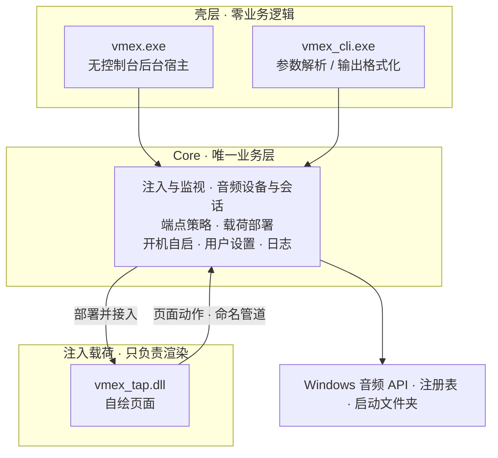

<!--
 readme编写规范：
  1. 所有readme都需要保留本说明且不可做任何翻译修改。主readme(中文版)是本说明的唯一源头(Source of Truth)，禁止将非中文版本中被修改的说明同步回主readme。非中文版的此说明需始终保持与主readme单向同步更新。
  2. 非中文版本的readme必须保留主readme(中文版)的所有视觉元素、HTML 标签、图标路径和排版格式，非中文版本的readme是中文版的完整对应精准同步翻译版，翻译不可笼统，不可修改原意，不可增减内容。
  3. 针对目标语言环境进行功能描述的本土化。
  4. 非中文版本的readme需要合理修改指向资源的路径，确保资源能够正确显示。
  5. 非中文版本的readme都需要保留并置顶本说明
  6. 非中文版本的readme都需要置顶以下元素，可以替换为相应的翻译版本但必须保留原意：
	    <div align="right">
	    <a href="../readme.md">For the latest updates, please refer to the Chinese README.</a>
	    </div>
  7. 任何关于项目内容的更新，必须首先在主readme(中文版)中完成。在主版确认无误后，再根据本规范同步至其他语言版本。
  8. 非中文版本的readme顶部的语言切换器仅保留指向主readme(中文版)的链接，不互相跳转。非中文版本的入口仅在主readme中统一显示。
-->
<div align="right">
  <a href=".github/readme_res/readme_en.md">English</a>
</div>
<div align="center">

# VolumeMixerExtender

**把快速设置里的音量面板，变成一台完整的混音台**

  <a href="https://github.com/EricZhang233/VolumeMixerExtender/releases/latest"></a>
  <a href="https://github.com/EricZhang233/VolumeMixerExtender/releases/latest"></a>
  <a href="https://github.com/EricZhang233/VolumeMixerExtender/stargazers"></a>

  [](https://isocpp.org/)
  [](https://cmake.org/)
  [](https://www.microsoft.com/windows)
  [](https://www.gnu.org/licenses/gpl-3.0.html)

<a href="#highlights">亮点速览</a> • <a href="#quickstart">快速开始</a> • <a href="#features">功能详解</a> • <a href="#cli">命令行</a> • <a href="#architecture">技术架构</a> • <a href="#faq">常见问题</a>

</div>

---

<a name="highlights"></a>

## 亮点速览

*   🎛️ **入口即页面**：快速设置里点「选择声音输出」，不再落到系统原生声音页，而是直接进入自绘页面；按 `Win+Ctrl+V` 打开声音页也一样。
*   🔊 **默认设备随手换**：输出与输入设备各成一组列表，点一下设备行就切换系统默认设备，当前默认带强调色高亮。
*   🎚️ **端点与逐应用音量**：设备总音量、逐应用音量与静音、实时音量条都在同一页，不必再往系统设置里翻。
*   🔀 **逐应用输出重定向**：让某个应用单独走某台输出设备——「游戏走耳机、播放器走音箱」；已重定向的应用会常显它的去向。
*   🧹 **一键清除重定向**：底栏左格把全部应用恢复为默认设备，点完立刻可见。
*   🪟 **三态页面**：自定义页、设置页、系统页共用同一行底栏，随时来回切，系统原生页面依旧完好。
*   💻 **命令行管理**：`vmex_cli.exe` 覆盖注入、状态、端点、默认设备、重定向与开机自启，`-help` 与 `skill` 内置完整文档。
*   🚀 **双击即用**：`vmex.exe` 无控制台常驻、自动接入、单实例运行，不开窗口、不驻托盘。

---

<a name="quickstart"></a>

## 快速开始

### 环境要求

| 项目 | 要求 |
| :--- | :--- |
| 操作系统 | Windows 11 26H2（Build 26300）或更高版本，x64 |
| 运行依赖 | 无。纯原生实现，不依赖 .NET 或任何第三方运行库 |
| 管理员权限 | 不需要，全程用户级（只写 `HKCU` 与当前用户目录） |
| 安装 | 不需要，压缩包解压即用 |

### 三步上手

1. **下载**：从 [Releases](https://github.com/EricZhang233/VolumeMixerExtender/releases) 取最新压缩包，解压到任意目录（路径含中文或空格都可以）。
2. **运行**：双击 `vmex.exe`。它没有控制台窗口，会在后台常驻并自动接入系统外壳，启动与接入完成时各弹一条通知。希望它跟着登录自动就绪，就在自绘页的 **设置 → 开机启动** 打开开关。
3. **使用**：按 `Win+A` 打开快速设置，点「选择声音输出」，看到的就是自绘页面。

> 💡 习惯命令行？`vmex_cli.exe -help` 看全部命令，`vmex_cli.exe skill` 取面向脚本与 AI Agent 的接入文档。

---

<a name="features"></a>

## 功能详解

### 接管「选择声音输出」入口

*   **只换内容、不改导航**：识别到声音页出现后替换它的内容区，原内容被完整保存，切回系统页即可原样还回去。
*   **四条路径都认**：点入口按钮、按 `Win+Ctrl+V` 都能进自绘页；辅助功能、投影等其它页面保持系统原样，不会误接管。
*   **每次打开都重新判断**：面板每次打开都会重建，页面照样接管，不需要重启任何东西，也不会有「只能用一次」的毛病。

### 默认设备与端点音量

*   **「音量」层就是默认设备开关**：列出全部输出设备，点选设备行即把它设为系统默认设备，当前默认以强调色高亮。
*   **一台设备一行**：名称、静音按钮、音量滑块与实时音量条同排，拖动即时生效。
*   **输入侧默认收起**：采集设备收成「输入设备（N）」一行，点一下展开，不挤占输出列表的位置。
*   **「显示驱动名」开关**：设备行、重定向下拉与「→ 端点名」三处同步决定是否带驱动名后缀，默认开启，改完即记住。

### 音量合成器

*   **逐应用控制**：应用图标、名称、音量滑块与静音按钮排成一行，调哪个应用不必再去翻系统设置。
*   **图标来自程序自身**：提取不到时回落为名称首字母色块，不留空白。
*   **会话会自愈**：每次打开面板都重新枚举；音频服务重启、切换 Windows 用户后即使会话全部失效，也会自动重新取回并重新画出，而不是永久空白。
*   **空列表有落点**：当前没有应用发声时显示「（当前没有正在发声的应用）」。

### 逐应用输出重定向

*   **点重定向图标后展开**：在下拉里选目标输出设备；首项「默认设备」表示取消重定向、恢复跟随系统默认。
*   **去向常显**：已重定向的应用在名称下方显示一行「→ 端点名」，一眼看清它此刻走的是哪台设备。
*   **系统声音不参与**：`系统声音` 行不提供重定向。
*   **一键清除**：底栏左格「清除重定向」把全部应用恢复为默认设备，并立即刷新页面。

### 设置页

| 项目 | 说明 |
| :--- | :--- |
| **开机启动** | 注册或移除登录自启。开关状态取自自启项本身，在「任务管理器 → 启动」里被系统禁用也会如实显示为关 |
| **显示驱动名** | 设备名是否附带驱动名后缀，默认开启 |
| **退出程序** | 结束注入并退出后台进程；系统外壳随即重启，音量面板回到原生状态 |
| **从系统卸载** | 连续点击 5 次（相邻两次间隔不超过 0.5 秒）确认后，删除开机自启项并结束外壳进程；只回落为系统原生行为，不删除程序文件 |

### 后台常驻与通知

*   双击 `vmex.exe` 即启动，没有控制台窗口、没有托盘图标、没有主界面。
*   启动与接入完成时各弹一条系统通知；由登录自启拉起时不打扰。
*   单实例：已经在运行时，重复启动会被拒绝，而不是开出第二份。

---

<a name="cli"></a>

## 命令行：桌面端与终端共用同一份核心

`vmex_cli.exe` 与 `vmex.exe` 链接同一个 Core（`vmex_core.dll`），读写同一份状态——命令行里改完，回到面板重新打开看到的就是新值。

随程序内置两份文档，不必再去找别的说明：

```powershell
vmex_cli.exe -help     # 完整命令与参数说明
vmex_cli.exe skill     # 面向脚本与 AI Agent 的接入文档
```

当前版本可以在命令行完成：载荷释放、注入与状态查询、后台进程、端点枚举（`devices`）、默认设备切换（`default`）、逐应用重定向与清除（`redirect` / `clear-redirect`）、开机自启（`autostart`）。完整清单与参数以 `-help` 为准，它随程序一起更新。

---

<a name="architecture"></a>

## 技术架构

**VolumeMixerExtender** 的每一行业务逻辑都只存在一份：两个壳层（后台宿主与控制台）共用同一个 Core，不存在平行实现。



*   **纯原生实现**：C++20 + CMake，零第三方库；压缩包里只有 `vmex.exe`、`vmex_cli.exe` 与 `vmex_core.dll`，注入载荷内置在程序里、运行期按需释放。
*   **单一 Core 原则**：后台宿主与命令行共用业务层，功能天然对齐，日志统一记录。
*   **页面即载荷**：界面由注入到系统外壳内的模块渲染，跟随系统浅色/深色主题与强调色，不额外开窗、不驻留托盘。
*   **动作走本机管道**：页面上的写操作经命名管道交给宿主执行，页面自身不长期持有系统句柄。
*   **如实呈现事实**：默认设备与重定向都直接读系统当前状态，不另存一份本地镜像，也就不会出现「界面说的和系统做的不一致」。
*   **安全边界**：与系统外壳同完整性级别运行，不申请管理员权限、不修改任何系统文件。

---

<a name="faq"></a>

## 常见问题

<details>
<summary><b>为什么任务管理器里会有一个 vmex.exe？</b></summary>

它是后台宿主，负责接入系统外壳，并把页面上的操作落到实处。它没有窗口、没有托盘图标，也不联网上传任何内容。不需要时，在自绘页 **设置 → 退出程序** 结束它即可。
</details>

<details>
<summary><b>怎么彻底退出，而不是留在后台？</b></summary>

打开自绘页底栏中格的 **设置**，点「退出程序」：注入会被结束、后台宿主退出，系统外壳随即重启，音量面板回到原生状态。「开机启动」开关不受影响，想关掉就在同一页关。
</details>

<details>
<summary><b>需要安装吗？会写注册表吗？</b></summary>

不需要安装，解压即用。确实会写的地方只有：开启「开机启动」时在「启动」文件夹创建快捷方式；用户设置（例如「显示驱动名」）写入 `HKCU\Software\EricSoft\VolumeMixerExtender`；为完成接管把自身载荷释放到临时目录并接入系统外壳。它不修改任何系统文件，也不需要管理员权限。
</details>

<details>
<summary><b>我的数据存在哪里？</b></summary>

| 内容 | 位置 |
| :--- | :--- |
| 用户设置 | `HKCU\Software\EricSoft\VolumeMixerExtender` |
| 程序配置 | `%LOCALAPPDATA%\VolumeMixerExtender\vmex.ini` |
| 缓存与日志 | `%TEMP%\eric\VolumeMixerExtender`：日志在 `log\`（一次进程会话一个文件），应用图标缓存在 `icons\`，可随时删除 |

逐应用重定向与系统默认设备都由 Windows 自己保存（系统持久默认端点表），程序不另存一份镜像。
</details>

<details>
<summary><b>升级怎么升？</b></summary>

先让它退出（**设置 → 退出程序**），再用新版本包里的文件覆盖原目录，然后重新双击 `vmex.exe`。注入模块活在系统外壳进程里，不重启外壳就换不掉——这也是必须先退出的原因。
</details>

<details>
<summary><b>安全软件报警或拦截怎么办？</b></summary>

接入用的是系统自带的 XAML 诊断接口（与系统自身的扩展方式同源），但「把模块送入另一个进程」这个动作本身容易被安全软件判为可疑。若被拦截或误报，请为程序目录添加信任后重试。
</details>

<details>
<summary><b>应用多了要滚动很久？</b></summary>

这是当前的取舍：端点音量与应用列表共用一个滚动区，列表长了就要往下滚。后续版本会再考虑压缩或分组。
</details>

<details>
<summary><b>支持 Windows 10 吗？</b></summary>

不支持。需要 **Windows 11 26H2（Build 26300）** 或更高版本；版本不足时程序会拒绝启动并说明原因。
</details>

---

## 贡献与支持

欢迎任何形式的贡献——无论是提交 Bug、改进文档，还是提交代码（PR）。

*   发现异常或有功能建议？前往 [Issues](https://github.com/EricZhang233/VolumeMixerExtender/issues) 反馈，附上复现步骤与 `%TEMP%\eric\VolumeMixerExtender\log` 里的日志会更快被处理。
*   想参与开发？工程使用 CMake + Visual Studio 构建，后台宿主与控制台共用同一套 Core，改一处即可两端生效。

如果你觉得这个项目对你有帮助，请给它由衷的一颗 ⭐️ **Star**！

<a name="thanks"></a>

## 特别致谢

*   [**EarTrumpet**](https://github.com/File-New-Project/EarTrumpet)：逐应用音量与输出端点的概念与交互参考。本项目在这一方向上重写了会话枚举策略——每次使用都重新枚举、不跨时间缓存失效的枚举器，以避免「应用列表丢失后永久空白」那一类经典问题。
*   [**Windows App SDK / XAML 诊断接口**](https://learn.microsoft.com/windows/apps/)：本项目的接管能力建立在系统自带的 XAML 诊断与可视化树接口之上。

---

本项目以 [GPL-3.0](./LICENSE) 授权。

<div align="center">
  Made with ❤️ by EricZhang233
</div>